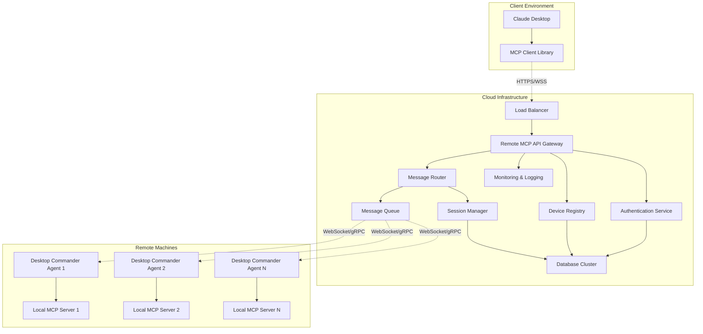
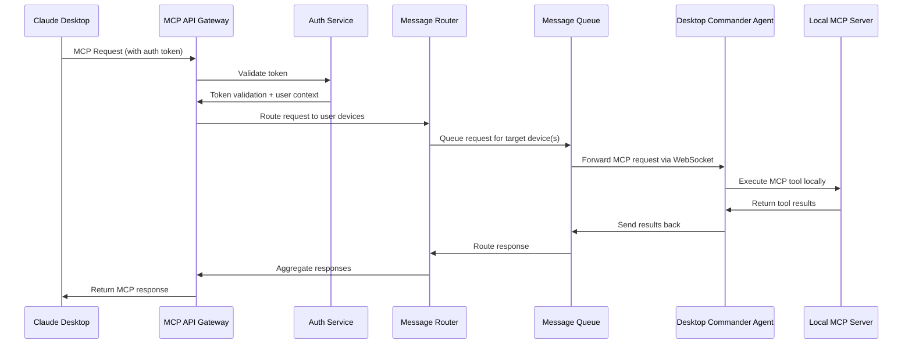
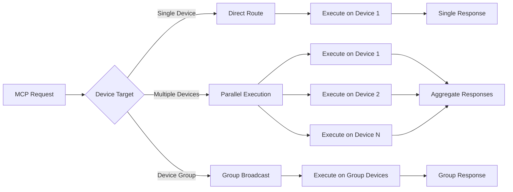

# Technical Architecture

## Overview

This document provides detailed technical specifications for the Remote MCP extension architecture, including data flows, communication protocols, and implementation details for all three components.

## System Architecture

### High-Level Component Diagram



## Data Flow Architecture

### Request Processing Flow



### Multi-Device Request Handling



## Communication Protocols

### MCP Over HTTPS

**Client to Cloud Service**:
- Protocol: HTTPS/2 with WebSocket upgrade
- Authentication: Bearer token in Authorization header
- Content-Type: `application/json`
- Custom headers for MCP protocol versioning

```typescript
interface MCPRequest {
  jsonrpc: "2.0";
  id: string | number;
  method: string;
  params?: any;
  meta?: {
    targetDevices?: string[];
    timeout?: number;
    parallel?: boolean;
  };
}

interface MCPResponse {
  jsonrpc: "2.0";
  id: string | number;
  result?: any;
  error?: MCPError;
  meta?: {
    sourceDevice?: string;
    executionTime?: number;
    aggregated?: boolean;
  };
}
```

### Agent Communication Protocol

**Cloud to Agent Communication**:
- Protocol: WebSocket Secure (WSS) with gRPC fallback
- Authentication: JWT token on connection + message signing
- Compression: gzip for large payloads
- Heartbeat: 30-second intervals with exponential backoff

```typescript
interface AgentMessage {
  type: 'mcp_request' | 'heartbeat' | 'config_update' | 'disconnect';
  id: string;
  timestamp: number;
  payload: any;
  signature?: string; // HMAC-SHA256 for critical operations
}

interface AgentResponse {
  type: 'mcp_response' | 'heartbeat_ack' | 'error' | 'status';
  id: string;
  timestamp: number;
  payload: any;
  executionMeta?: {
    startTime: number;
    endTime: number;
    memoryUsed: number;
    cpuTime: number;
  };
}
```

## Component Specifications

### 1. Remote MCP API Gateway

**Technology Stack**:
- Runtime: Node.js 20+ with TypeScript
- Framework: Fastify with MCP plugin architecture
- WebSocket: ws library with custom protocol handling
- Database: PostgreSQL with Redis for caching
- Message Queue: Redis with Bull queue management

**Core Services**:

```typescript
class MCPGateway {
  private authService: AuthenticationService;
  private deviceRegistry: DeviceRegistry;
  private messageRouter: MessageRouter;
  private sessionManager: SessionManager;

  async handleMCPRequest(request: MCPRequest, userToken: string): Promise<MCPResponse> {
    // 1. Validate authentication
    const user = await this.authService.validateToken(userToken);
    
    // 2. Resolve target devices
    const devices = await this.deviceRegistry.getDevicesForUser(user.id);
    const targetDevices = this.resolveTargetDevices(request.meta?.targetDevices, devices);
    
    // 3. Route request
    const results = await this.messageRouter.routeToDevices(request, targetDevices);
    
    // 4. Aggregate and return
    return this.aggregateResponses(results);
  }
}
```

**Key Features**:
- Horizontal scaling with Redis session storage
- Request deduplication and caching
- Circuit breaker pattern for agent connections
- Rate limiting and quota management
- Real-time monitoring and alerting

### 2. Desktop Commander Remote Agent

**Enhanced Local Architecture**:

```typescript
class RemoteDesktopCommanderAgent {
  private websocketClient: WebSocketClient;
  private mcpServer: DesktopCommanderMCP;
  private authManager: DeviceAuthManager;
  private connectionManager: ConnectionManager;

  async initialize(): Promise<void> {
    // Load device credentials
    await this.authManager.loadCredentials();
    
    // Initialize local MCP server
    await this.mcpServer.initialize();
    
    // Establish cloud connection
    await this.connectionManager.connect();
    
    // Start message handling
    this.websocketClient.onMessage(this.handleRemoteRequest.bind(this));
  }

  private async handleRemoteRequest(message: AgentMessage): Promise<void> {
    const startTime = Date.now();
    
    try {
      // Execute MCP request locally
      const result = await this.mcpServer.handleRequest(message.payload);
      
      // Send response back to cloud
      await this.websocketClient.send({
        type: 'mcp_response',
        id: message.id,
        timestamp: Date.now(),
        payload: result,
        executionMeta: {
          startTime,
          endTime: Date.now(),
          memoryUsed: process.memoryUsage().heapUsed,
          cpuTime: process.cpuUsage().system
        }
      });
    } catch (error) {
      // Handle errors and send error response
      await this.websocketClient.send({
        type: 'error',
        id: message.id,
        timestamp: Date.now(),
        payload: { error: error.message }
      });
    }
  }
}
```

**Connection Management**:
- Persistent WebSocket with automatic reconnection
- Exponential backoff for connection failures
- Graceful degradation during network issues
- Local operation queuing during disconnection

### 3. Device Registry Service

**Device Management**:

```typescript
interface Device {
  id: string;
  userId: string;
  name: string;
  type: 'desktop' | 'server' | 'mobile';
  capabilities: string[];
  lastSeen: Date;
  status: 'online' | 'offline' | 'maintenance';
  configuration: {
    allowedDirectories: string[];
    blockedCommands: string[];
    resourceLimits: {
      maxMemory: number;
      maxCPU: number;
      maxDisk: number;
    };
  };
  metadata: {
    os: string;
    architecture: string;
    version: string;
    ipAddress?: string;
    location?: string;
  };
}

class DeviceRegistry {
  async registerDevice(userId: string, deviceInfo: Partial<Device>): Promise<Device> {
    // Generate device ID and credentials
    const device = await this.createDevice(userId, deviceInfo);
    
    // Store in database
    await this.db.devices.create(device);
    
    // Generate device token
    const token = await this.authService.generateDeviceToken(device);
    
    return { ...device, token };
  }

  async getActiveDevicesForUser(userId: string): Promise<Device[]> {
    return this.db.devices.findMany({
      where: {
        userId,
        status: 'online',
        lastSeen: {
          gte: new Date(Date.now() - 5 * 60 * 1000) // 5 minutes
        }
      }
    });
  }
}
```

## Performance Considerations

### Scalability Targets

**Concurrent Users**: 10,000+ simultaneous users
**Device Connections**: 100,000+ connected devices
**Request Throughput**: 50,000+ requests per second
**Response Latency**: < 2 seconds end-to-end for typical operations

### Optimization Strategies

**Caching**:
- Redis for session data and device status
- CDN for static assets and configuration
- Application-level caching for user device mappings

**Database Optimization**:
- Read replicas for device queries
- Partitioning by user ID for large tables
- Connection pooling and prepared statements

**Message Queue Optimization**:
- Topic-based routing for efficient device targeting
- Batch processing for bulk operations
- Dead letter queues for failed requests

### Monitoring and Observability

**Metrics Collection**:
- Request latency and throughput
- Device connection status and health
- Authentication success/failure rates
- Resource utilization per component

**Logging Strategy**:
- Structured JSON logging
- Request tracing across components
- Security event logging
- Performance profiling data

**Alerting**:
- SLA breach notifications
- Security anomaly detection
- Infrastructure health monitoring
- Capacity planning alerts

This architecture provides a robust, scalable foundation for remote MCP operations while maintaining security and performance requirements.