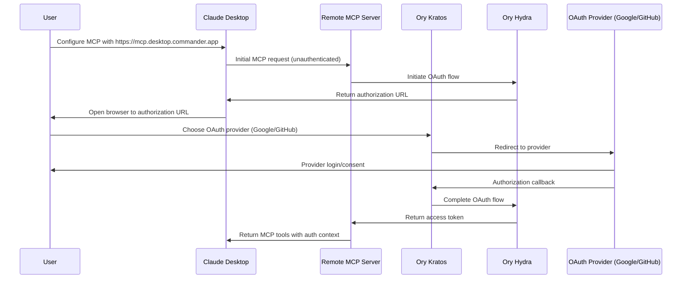
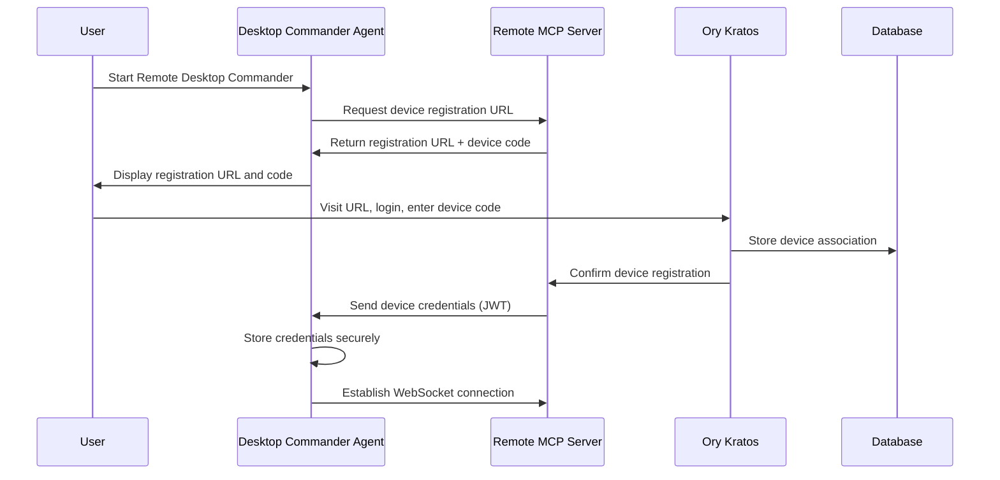
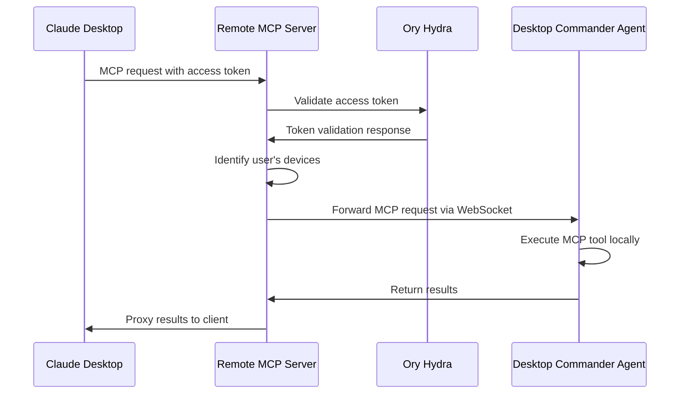

# Authentication & Security Architecture

## Overview

This document details the authentication and security implementation for the Remote MCP extension, utilizing Ory Kratos and Ory Hydra for robust OAuth 2.0 authentication with third-party provider support.

## Authentication Stack

### Ory Kratos (Identity Management)
- **User Registration**: Self-service registration with email verification
- **Login Flows**: Multi-factor authentication with social login
- **Session Management**: Secure session handling with configurable TTL
- **Profile Management**: User profile and device management
- **Security Features**: Account recovery, password policies, rate limiting

### Ory Hydra (OAuth 2.0 Server)
- **Authorization Server**: OAuth 2.0 and OpenID Connect compliant
- **Client Management**: Dynamic client registration for MCP clients
- **Token Management**: JWT access tokens with refresh capabilities
- **Scope Management**: Fine-grained permission control
- **PKCE Support**: Enhanced security for public clients

### Supported Third-Party Providers
- **Google OAuth 2.0**: Google account integration
- **GitHub OAuth**: Developer-focused authentication
- **Microsoft Azure AD**: Enterprise integration
- **Custom OIDC**: Support for corporate identity providers

## Authentication Flows

### 1. Initial User Registration



### 2. Device Registration Flow



### 3. Request Authentication Flow



## Security Implementation

### Token Management

**Access Tokens (JWT)**:
```json
{
  "sub": "user-uuid",
  "iss": "https://auth.desktop.commander.app",
  "aud": "remote-mcp-client",
  "exp": 1640995200,
  "iat": 1640991600,
  "scope": "mcp:execute mcp:read mcp:write",
  "device_access": ["device-1-uuid", "device-2-uuid"],
  "session_id": "session-uuid"
}
```

**Device Tokens (JWT)**:
```json
{
  "sub": "device-uuid",
  "user_id": "user-uuid",
  "iss": "https://auth.desktop.commander.app",
  "aud": "desktop-commander-agent",
  "exp": 1672531200,
  "device_name": "user-macbook-pro",
  "capabilities": ["filesystem", "terminal", "search"],
  "restrictions": {
    "allowed_directories": ["/home/user", "/workspace"],
    "blocked_commands": ["rm -rf", "sudo"]
  }
}
```

### Secure Communication

**TLS/HTTPS Everywhere**:
- All communication encrypted in transit
- Certificate pinning for agent connections
- HSTS headers for web interfaces

**WebSocket Security**:
- WSS (WebSocket Secure) connections
- Bearer token authentication on connection
- Heartbeat mechanism for connection monitoring
- Automatic reconnection with exponential backoff

**API Security**:
- Rate limiting per user/device
- Request signing for critical operations
- Audit logging for all authenticated requests
- CORS policies for web clients

### Device Security

**Credential Storage**:
- OS-specific secure storage (Keychain, Credential Manager, etc.)
- Encrypted credential files as fallback
- Automatic credential rotation

**Device Attestation**:
- Device fingerprinting for additional security
- Hardware-based attestation where available
- Anomaly detection for suspicious activity

**Network Security**:
- Outbound connections only (no inbound ports)
- Firewall-friendly design
- Support for corporate proxy environments

## Permission Model

### Scopes and Permissions

**User-Level Scopes**:
- `mcp:execute` - Execute MCP tools on registered devices
- `mcp:read` - Read-only operations (file reading, listing)
- `mcp:write` - Write operations (file editing, creation)
- `mcp:admin` - Device management and configuration
- `mcp:terminal` - Terminal and process execution

**Device-Level Restrictions**:
- Directory access controls
- Command blocking/allowlisting
- Resource usage limits
- Time-based access restrictions

### Multi-Device Management

**Device Groups**:
- Logical grouping of devices (development, production, etc.)
- Group-based permission inheritance
- Batch operations across device groups

**Access Control**:
- Per-device permission overrides
- Temporary access grants
- Device-specific capabilities

## Security Considerations

### Threat Model

**Attack Vectors**:
- Compromised user credentials
- Device credential theft
- Man-in-the-middle attacks
- Session hijacking
- Privilege escalation

**Mitigations**:
- Multi-factor authentication
- Short-lived tokens with refresh rotation
- Certificate pinning
- Session binding
- Principle of least privilege

### Compliance and Privacy

**Data Protection**:
- GDPR compliance for EU users
- Data minimization principles
- User consent management
- Right to deletion

**Audit and Monitoring**:
- Comprehensive audit logs
- Real-time security monitoring
- Anomaly detection
- Incident response procedures

## Configuration Examples

### Ory Kratos Configuration
```yaml
# kratos.yml
serve:
  public:
    base_url: https://auth.desktop.commander.app
    cors:
      enabled: true
      allowed_origins:
        - https://mcp.desktop.commander.app

selfservice:
  default_browser_return_url: https://mcp.desktop.commander.app/auth/callback
  flows:
    registration:
      enabled: true
      ui_url: https://auth.desktop.commander.app/registration
    login:
      ui_url: https://auth.desktop.commander.app/login
    settings:
      ui_url: https://auth.desktop.commander.app/settings

oauth2_provider:
  enabled: true
  url: https://oauth.desktop.commander.app
```

### Ory Hydra Configuration
```yaml
# hydra.yml
serve:
  public:
    port: 4444
    host: 0.0.0.0
  admin:
    port: 4445
    host: 0.0.0.0

urls:
  self:
    issuer: https://oauth.desktop.commander.app
  consent: https://auth.desktop.commander.app/consent
  login: https://auth.desktop.commander.app/login

strategies:
  access_token: jwt
  scope: exact

oauth2:
  expose_internal_errors: false
  
ttl:
  access_token: 1h
  refresh_token: 720h
  id_token: 1h
  auth_code: 10m
```

This authentication architecture provides enterprise-grade security while maintaining ease of use for end users, enabling secure remote machine management through Claude's MCP interface.