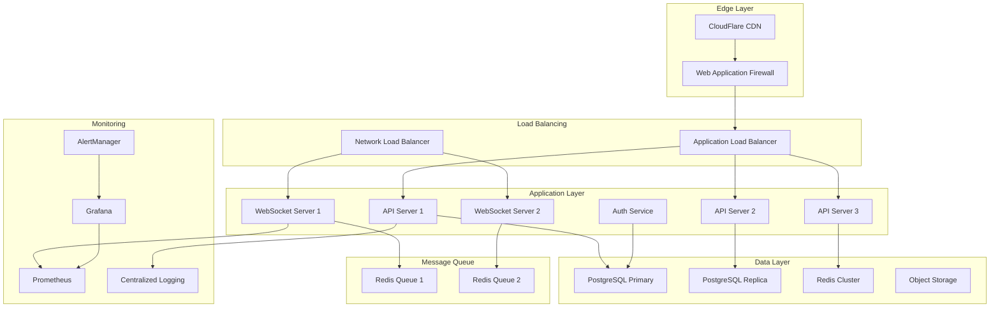

# Deployment & Infrastructure Guide

## Overview

This document outlines the infrastructure requirements, deployment strategies, and operational procedures for the Remote MCP extension cloud services.

## Infrastructure Architecture

### High-Level Infrastructure Diagram



## Cloud Provider Configuration

### AWS Infrastructure (Primary)

#### VPC Setup
```hcl
# terraform/aws/vpc.tf
resource "aws_vpc" "remote_mcp" {
  cidr_block           = "10.0.0.0/16"
  enable_dns_hostnames = true
  enable_dns_support   = true
  
  tags = {
    Name = "remote-mcp-vpc"
    Environment = var.environment
  }
}

resource "aws_subnet" "public" {
  count = 3
  
  vpc_id                  = aws_vpc.remote_mcp.id
  cidr_block              = "10.0.${count.index + 1}.0/24"
  availability_zone       = data.aws_availability_zones.available.names[count.index]
  map_public_ip_on_launch = true
  
  tags = {
    Name = "remote-mcp-public-${count.index + 1}"
    Type = "Public"
  }
}

resource "aws_subnet" "private" {
  count = 3
  
  vpc_id            = aws_vpc.remote_mcp.id
  cidr_block        = "10.0.${count.index + 10}.0/24"
  availability_zone = data.aws_availability_zones.available.names[count.index]
  
  tags = {
    Name = "remote-mcp-private-${count.index + 1}"
    Type = "Private"
  }
}
```

#### EKS Cluster Configuration
```yaml
# k8s/cluster.yaml
apiVersion: eksctl.io/v1alpha5
kind: ClusterConfig

metadata:
  name: remote-mcp-cluster
  region: us-west-2
  version: "1.28"

vpc:
  id: ${VPC_ID}
  subnets:
    private:
      us-west-2a: { id: ${PRIVATE_SUBNET_1} }
      us-west-2b: { id: ${PRIVATE_SUBNET_2} }
      us-west-2c: { id: ${PRIVATE_SUBNET_3} }
    public:
      us-west-2a: { id: ${PUBLIC_SUBNET_1} }
      us-west-2b: { id: ${PUBLIC_SUBNET_2} }
      us-west-2c: { id: ${PUBLIC_SUBNET_3} }

nodeGroups:
  - name: api-servers
    instanceType: m5.xlarge
    minSize: 3
    maxSize: 10
    desiredCapacity: 3
    privateNetworking: true
    labels:
      role: api-server
    taints:
      - key: role
        value: api-server
        effect: NoSchedule

  - name: websocket-servers
    instanceType: c5.2xlarge
    minSize: 2
    maxSize: 8
    desiredCapacity: 2
    privateNetworking: true
    labels:
      role: websocket-server
    taints:
      - key: role
        value: websocket-server
        effect: NoSchedule
```

#### RDS Configuration
```hcl
# terraform/aws/rds.tf
resource "aws_db_instance" "postgresql_primary" {
  identifier = "remote-mcp-pg-primary"
  
  engine         = "postgres"
  engine_version = "15.4"
  instance_class = "db.r6g.xlarge"
  
  allocated_storage     = 100
  max_allocated_storage = 1000
  storage_type          = "gp3"
  storage_encrypted     = true
  kms_key_id           = aws_kms_key.rds.arn
  
  db_name  = "remotemcp"
  username = "remotemcp_user"
  password = var.db_password
  
  vpc_security_group_ids = [aws_security_group.rds.id]
  db_subnet_group_name   = aws_db_subnet_group.main.name
  
  backup_retention_period = 7
  backup_window          = "03:00-04:00"
  maintenance_window     = "Sun:04:00-Sun:05:00"
  
  multi_az               = true
  publicly_accessible    = false
  
  deletion_protection = true
  skip_final_snapshot = false
  final_snapshot_identifier = "remote-mcp-pg-final-snapshot"
  
  tags = {
    Name = "remote-mcp-postgresql-primary"
    Environment = var.environment
  }
}

resource "aws_db_instance" "postgresql_replica" {
  identifier = "remote-mcp-pg-replica"
  
  replicate_source_db = aws_db_instance.postgresql_primary.identifier
  instance_class      = "db.r6g.large"
  
  publicly_accessible = false
  skip_final_snapshot = true
  
  tags = {
    Name = "remote-mcp-postgresql-replica"
    Environment = var.environment
  }
}
```

### Redis Configuration
```yaml
# k8s/redis-cluster.yaml
apiVersion: redis.redis.opstreelabs.in/v1beta1
kind: RedisCluster
metadata:
  name: remote-mcp-redis
  namespace: remote-mcp
spec:
  clusterSize: 6
  kubernetesConfig:
    image: redis:7.2
    resources:
      requests:
        cpu: 200m
        memory: 1Gi
      limits:
        cpu: 500m
        memory: 2Gi
    redisSecret:
      name: redis-secret
      key: password
  redisExporter:
    enabled: true
    image: quay.io/oliver006/redis_exporter:latest
  storage:
    volumeClaimTemplate:
      spec:
        accessModes: ["ReadWriteOnce"]
        resources:
          requests:
            storage: 10Gi
```

## Application Deployment

### Docker Configuration

#### API Server Dockerfile
```dockerfile
# Dockerfile.api
FROM node:20-alpine AS builder

WORKDIR /app
COPY package*.json ./
RUN npm ci --only=production

COPY . .
RUN npm run build

FROM node:20-alpine AS runner

RUN apk add --no-cache dumb-init
RUN addgroup -g 1001 -S nodejs
RUN adduser -S nextjs -u 1001

WORKDIR /app

COPY --from=builder --chown=nextjs:nodejs /app/dist ./dist
COPY --from=builder --chown=nextjs:nodejs /app/node_modules ./node_modules
COPY --from=builder --chown=nextjs:nodejs /app/package.json ./package.json

USER nextjs

EXPOSE 3000

ENV NODE_ENV production
ENV PORT 3000

CMD ["dumb-init", "node", "dist/index.js"]
```

#### WebSocket Server Dockerfile
```dockerfile
# Dockerfile.websocket
FROM node:20-alpine AS builder

WORKDIR /app
COPY package*.json ./
RUN npm ci --only=production

COPY . .
RUN npm run build:websocket

FROM node:20-alpine AS runner

RUN apk add --no-cache dumb-init curl
RUN addgroup -g 1001 -S nodejs
RUN adduser -S websocket -u 1001

WORKDIR /app

COPY --from=builder --chown=websocket:nodejs /app/dist ./dist
COPY --from=builder --chown=websocket:nodejs /app/node_modules ./node_modules
COPY --from=builder --chown=websocket:nodejs /app/package.json ./package.json

USER websocket

EXPOSE 8080

ENV NODE_ENV production
ENV WS_PORT 8080

HEALTHCHECK --interval=30s --timeout=3s --start-period=5s --retries=3 \
  CMD curl -f http://localhost:8080/health || exit 1

CMD ["dumb-init", "node", "dist/websocket-server.js"]
```

### Kubernetes Deployments

#### API Server Deployment
```yaml
# k8s/api-deployment.yaml
apiVersion: apps/v1
kind: Deployment
metadata:
  name: remote-mcp-api
  namespace: remote-mcp
spec:
  replicas: 3
  selector:
    matchLabels:
      app: remote-mcp-api
  template:
    metadata:
      labels:
        app: remote-mcp-api
    spec:
      nodeSelector:
        role: api-server
      tolerations:
      - key: role
        operator: Equal
        value: api-server
        effect: NoSchedule
      containers:
      - name: api
        image: remote-mcp/api:latest
        ports:
        - containerPort: 3000
        env:
        - name: DATABASE_URL
          valueFrom:
            secretKeyRef:
              name: database-secret
              key: url
        - name: REDIS_URL
          valueFrom:
            secretKeyRef:
              name: redis-secret
              key: url
        - name: JWT_SECRET
          valueFrom:
            secretKeyRef:
              name: jwt-secret
              key: secret
        resources:
          requests:
            cpu: 200m
            memory: 512Mi
          limits:
            cpu: 1
            memory: 1Gi
        livenessProbe:
          httpGet:
            path: /health
            port: 3000
          initialDelaySeconds: 30
          periodSeconds: 10
        readinessProbe:
          httpGet:
            path: /ready
            port: 3000
          initialDelaySeconds: 5
          periodSeconds: 5
---
apiVersion: v1
kind: Service
metadata:
  name: remote-mcp-api-service
  namespace: remote-mcp
spec:
  selector:
    app: remote-mcp-api
  ports:
  - port: 80
    targetPort: 3000
  type: ClusterIP
```

#### WebSocket Server Deployment
```yaml
# k8s/websocket-deployment.yaml
apiVersion: apps/v1
kind: Deployment
metadata:
  name: remote-mcp-websocket
  namespace: remote-mcp
spec:
  replicas: 2
  selector:
    matchLabels:
      app: remote-mcp-websocket
  template:
    metadata:
      labels:
        app: remote-mcp-websocket
    spec:
      nodeSelector:
        role: websocket-server
      tolerations:
      - key: role
        operator: Equal
        value: websocket-server
        effect: NoSchedule
      containers:
      - name: websocket
        image: remote-mcp/websocket:latest
        ports:
        - containerPort: 8080
        env:
        - name: REDIS_URL
          valueFrom:
            secretKeyRef:
              name: redis-secret
              key: url
        - name: JWT_SECRET
          valueFrom:
            secretKeyRef:
              name: jwt-secret
              key: secret
        resources:
          requests:
            cpu: 500m
            memory: 1Gi
          limits:
            cpu: 2
            memory: 4Gi
        livenessProbe:
          httpGet:
            path: /health
            port: 8080
          initialDelaySeconds: 30
          periodSeconds: 10
---
apiVersion: v1
kind: Service
metadata:
  name: remote-mcp-websocket-service
  namespace: remote-mcp
spec:
  selector:
    app: remote-mcp-websocket
  ports:
  - port: 80
    targetPort: 8080
  type: ClusterIP
```

## CI/CD Pipeline

### GitHub Actions Workflow
```yaml
# .github/workflows/deploy.yml
name: Deploy Remote MCP

on:
  push:
    branches: [main]
  pull_request:
    branches: [main]

env:
  AWS_REGION: us-west-2
  EKS_CLUSTER_NAME: remote-mcp-cluster

jobs:
  test:
    runs-on: ubuntu-latest
    steps:
    - uses: actions/checkout@v4
    
    - name: Setup Node.js
      uses: actions/setup-node@v4
      with:
        node-version: '20'
        cache: 'npm'
    
    - name: Install dependencies
      run: npm ci
    
    - name: Run tests
      run: npm run test:ci
    
    - name: Run security audit
      run: npm audit --audit-level moderate
    
    - name: Run type check
      run: npm run type-check

  build:
    needs: test
    runs-on: ubuntu-latest
    steps:
    - uses: actions/checkout@v4
    
    - name: Configure AWS credentials
      uses: aws-actions/configure-aws-credentials@v4
      with:
        aws-access-key-id: ${{ secrets.AWS_ACCESS_KEY_ID }}
        aws-secret-access-key: ${{ secrets.AWS_SECRET_ACCESS_KEY }}
        aws-region: ${{ env.AWS_REGION }}
    
    - name: Login to Amazon ECR
      id: login-ecr
      uses: aws-actions/amazon-ecr-login@v2
    
    - name: Build and push Docker images
      env:
        ECR_REGISTRY: ${{ steps.login-ecr.outputs.registry }}
        IMAGE_TAG: ${{ github.sha }}
      run: |
        # Build API image
        docker build -f Dockerfile.api -t $ECR_REGISTRY/remote-mcp-api:$IMAGE_TAG .
        docker push $ECR_REGISTRY/remote-mcp-api:$IMAGE_TAG
        
        # Build WebSocket image  
        docker build -f Dockerfile.websocket -t $ECR_REGISTRY/remote-mcp-websocket:$IMAGE_TAG .
        docker push $ECR_REGISTRY/remote-mcp-websocket:$IMAGE_TAG

  deploy:
    needs: build
    runs-on: ubuntu-latest
    if: github.ref == 'refs/heads/main'
    steps:
    - uses: actions/checkout@v4
    
    - name: Configure AWS credentials
      uses: aws-actions/configure-aws-credentials@v4
      with:
        aws-access-key-id: ${{ secrets.AWS_ACCESS_KEY_ID }}
        aws-secret-access-key: ${{ secrets.AWS_SECRET_ACCESS_KEY }}
        aws-region: ${{ env.AWS_REGION }}
    
    - name: Update kubeconfig
      run: |
        aws eks update-kubeconfig --region $AWS_REGION --name $EKS_CLUSTER_NAME
    
    - name: Deploy to Kubernetes
      env:
        IMAGE_TAG: ${{ github.sha }}
      run: |
        # Update image tags in deployment manifests
        sed -i "s|image: remote-mcp/api:latest|image: $ECR_REGISTRY/remote-mcp-api:$IMAGE_TAG|g" k8s/api-deployment.yaml
        sed -i "s|image: remote-mcp/websocket:latest|image: $ECR_REGISTRY/remote-mcp-websocket:$IMAGE_TAG|g" k8s/websocket-deployment.yaml
        
        # Apply Kubernetes manifests
        kubectl apply -f k8s/
        
        # Wait for deployment to complete
        kubectl rollout status deployment/remote-mcp-api -n remote-mcp
        kubectl rollout status deployment/remote-mcp-websocket -n remote-mcp
```

## Monitoring & Logging

### Prometheus Configuration
```yaml
# monitoring/prometheus.yaml
global:
  scrape_interval: 15s
  evaluation_interval: 15s

rule_files:
  - "/etc/prometheus/rules/*.yml"

alerting:
  alertmanagers:
  - static_configs:
    - targets:
      - alertmanager:9093

scrape_configs:
  - job_name: 'api-servers'
    kubernetes_sd_configs:
    - role: pod
      namespaces:
        names:
        - remote-mcp
    relabel_configs:
    - source_labels: [__meta_kubernetes_pod_label_app]
      action: keep
      regex: remote-mcp-api

  - job_name: 'websocket-servers'
    kubernetes_sd_configs:
    - role: pod
      namespaces:
        names:
        - remote-mcp
    relabel_configs:
    - source_labels: [__meta_kubernetes_pod_label_app]
      action: keep
      regex: remote-mcp-websocket

  - job_name: 'redis-exporter'
    static_configs:
    - targets: ['redis-exporter:9121']

  - job_name: 'postgres-exporter'
    static_configs:
    - targets: ['postgres-exporter:9187']
```

### Grafana Dashboards
```json
{
  "dashboard": {
    "id": null,
    "title": "Remote MCP Overview",
    "panels": [
      {
        "title": "Request Rate",
        "type": "graph",
        "targets": [
          {
            "expr": "rate(http_requests_total[5m])",
            "legendFormat": "{{method}} {{status}}"
          }
        ]
      },
      {
        "title": "WebSocket Connections",
        "type": "stat",
        "targets": [
          {
            "expr": "websocket_connections_active",
            "legendFormat": "Active Connections"
          }
        ]
      },
      {
        "title": "Database Performance", 
        "type": "graph",
        "targets": [
          {
            "expr": "pg_stat_database_tup_fetched",
            "legendFormat": "Rows Fetched"
          }
        ]
      }
    ]
  }
}
```

## Security & Backup Procedures

### Backup Strategy
```bash
#!/bin/bash
# scripts/backup.sh

# PostgreSQL backup
pg_dump -h $PG_HOST -U $PG_USER -d remotemcp | gzip > /backups/postgres_$(date +%Y%m%d_%H%M%S).sql.gz

# Redis backup  
redis-cli --rdb /backups/redis_$(date +%Y%m%d_%H%M%S).rdb

# Upload to S3
aws s3 sync /backups/ s3://remote-mcp-backups/$(date +%Y/%m/%d)/

# Cleanup local backups older than 7 days
find /backups -name "*.gz" -mtime +7 -delete
find /backups -name "*.rdb" -mtime +7 -delete
```

### Disaster Recovery
```yaml
# dr/recovery-plan.yaml
recovery_objectives:
  RTO: 4 hours  # Recovery Time Objective
  RPO: 1 hour   # Recovery Point Objective

procedures:
  database_recovery:
    - Restore from latest automated backup
    - Apply transaction log replay if available
    - Validate data integrity
  
  application_recovery:
    - Deploy to DR region using blue-green strategy
    - Update DNS records to point to DR environment
    - Verify all services operational
  
  rollback_plan:
    - Maintain previous version containers
    - Database rollback scripts ready
    - DNS change procedures documented
```

This deployment guide provides a comprehensive foundation for operating the Remote MCP extension at scale with high availability, security, and observability.