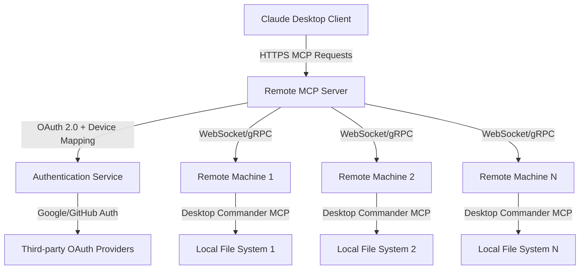

# Remote MCP Extension - Implementation Plan

## Overview

This document outlines the comprehensive plan to extend Desktop Commander MCP with remote machine management capabilities. The solution enables users to manage remote machines directly through Claude using standard MCP tools via a secure, OAuth-authenticated cloud service.

## Architecture Vision



## Three-Component Architecture

### 1. MCP Client (Claude Desktop)
- **Role**: Standard MCP client making requests to remote server
- **Configuration**: Points to `https://mcp.desktop.commander.app` instead of local server
- **Authentication**: OAuth 2.0 flow via browser redirect
- **Protocol**: HTTPS MCP over REST/WebSocket

### 2. Remote MCP Server (Cloud Service)
- **Role**: Central orchestration and routing service
- **Responsibilities**:
  - Handle OAuth authentication and session management
  - Maintain user-to-device mapping
  - Route MCP requests to appropriate remote machines
  - Aggregate and proxy responses back to client
- **Technology Stack**: Node.js/TypeScript, Express, WebSocket/gRPC
- **Deployment**: Cloud service (AWS/GCP/Azure)

### 3. Remote Desktop Commander (Local Machine)
- **Role**: Extended Desktop Commander with remote connectivity
- **Responsibilities**:
  - Connect to cloud service via secure tunnel
  - Execute MCP tools locally
  - Stream results back to cloud service
- **Protocol**: WebSocket/gRPC with heartbeat and reconnection
- **Security**: Device-specific authentication tokens

## Key Components Detail

### Authentication Service (Ory Kratos + Hydra)

**Ory Kratos** (Identity Management):
- User registration and login flows
- Third-party OAuth integration (Google, GitHub, etc.)
- Session management and user profiles
- Device registration and management

**Ory Hydra** (OAuth 2.0 Server):
- OAuth 2.0 authorization flows
- Token issuance and validation
- Client credentials management
- Scope-based access control

### Device Registration Flow

1. **Initial Setup**:
   - User installs Remote Desktop Commander on local machine
   - Agent starts and prompts for device registration
   - User visits registration URL and logs in via OAuth
   - System generates device-specific credentials
   - Device establishes persistent connection to cloud service

2. **Device Authentication**:
   - JWT tokens with device-specific claims
   - Automatic token refresh mechanism
   - Secure credential storage on local machine

### Request Flow

1. **Client Authentication**:
   - Claude Desktop configured with remote MCP server URL
   - OAuth 2.0 authorization code flow via browser
   - Access token stored for subsequent requests

2. **Request Routing**:
   - Remote server validates client token
   - Identifies target device(s) from user context
   - Routes MCP request to appropriate device via WebSocket/gRPC
   - Aggregates responses from multiple devices if needed

3. **Response Handling**:
   - Local Desktop Commander executes MCP tool
   - Results streamed back to cloud service
   - Cloud service proxies response to Claude Desktop
   - Maintains request correlation and error handling

## File Structure

```
REMOTE_MCP_PLAN/
├── README.md                    # This overview document
├── ARCHITECTURE.md              # Detailed technical architecture
├── AUTHENTICATION.md            # OAuth and security implementation
├── DEPLOYMENT.md               # Infrastructure and deployment guide
├── API_SPECIFICATION.md        # API contracts and protocols
├── SECURITY.md                 # Security considerations and best practices
├── TESTING.md                  # Testing strategy and scenarios
└── IMPLEMENTATION_ROADMAP.md   # Development phases and timeline
```

## Next Steps

1. **Review and Validation**: Review this plan for completeness and feasibility
2. **Detailed Design**: Create comprehensive technical specifications
3. **Security Assessment**: Validate security model and threat analysis
4. **Implementation Planning**: Break down into development phases
5. **Proof of Concept**: Build minimal viable implementation
6. **Testing Strategy**: Define testing approaches for all components
7. **Deployment Planning**: Infrastructure requirements and CI/CD

## Success Criteria

- ✅ Users can authenticate once and manage multiple remote machines
- ✅ All existing Desktop Commander MCP tools work seamlessly on remote machines
- ✅ Secure, scalable architecture supporting thousands of concurrent users
- ✅ Low latency for typical operations (< 2 seconds end-to-end)
- ✅ Robust error handling and connection recovery
- ✅ Easy setup and configuration for end users
- ✅ Cost-effective infrastructure that scales with usage

This plan provides the foundation for implementing a revolutionary remote machine management capability that extends Claude's power across distributed computing environments.