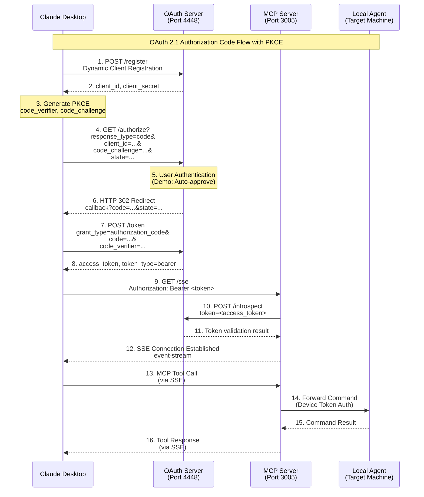
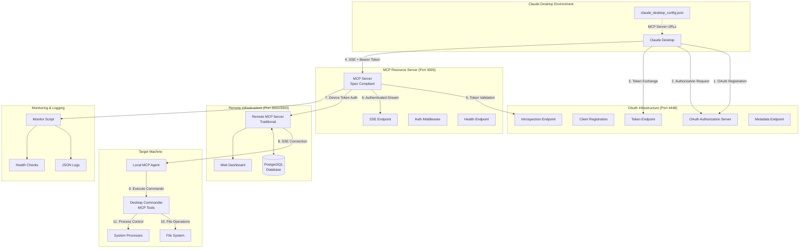
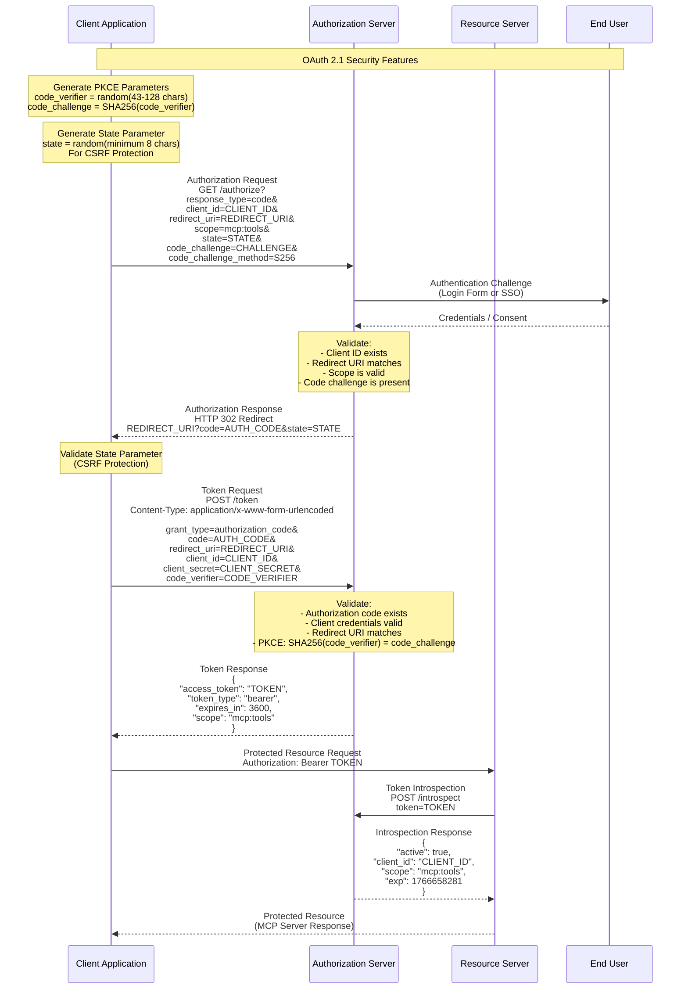
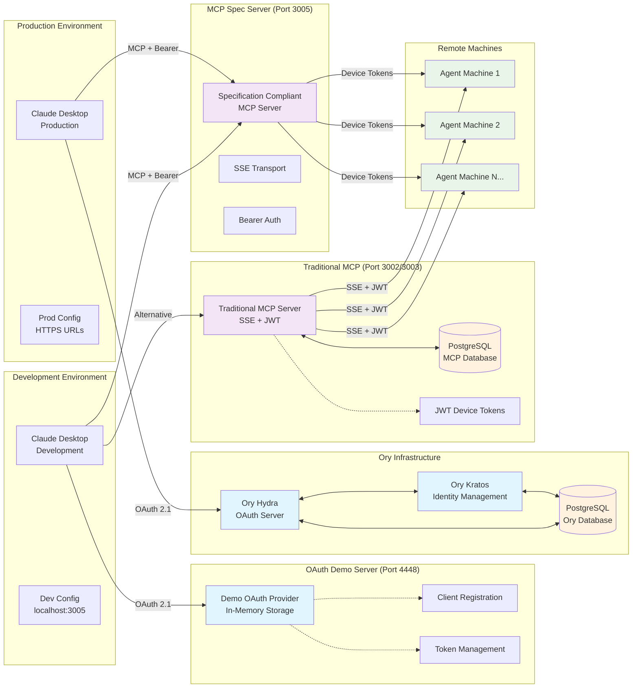
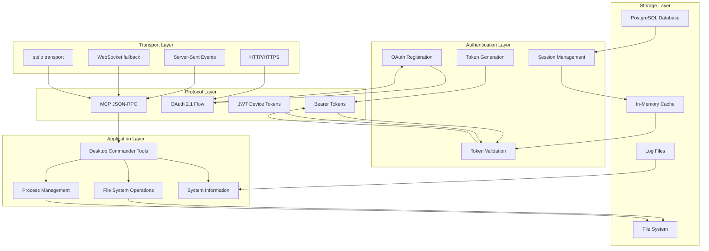
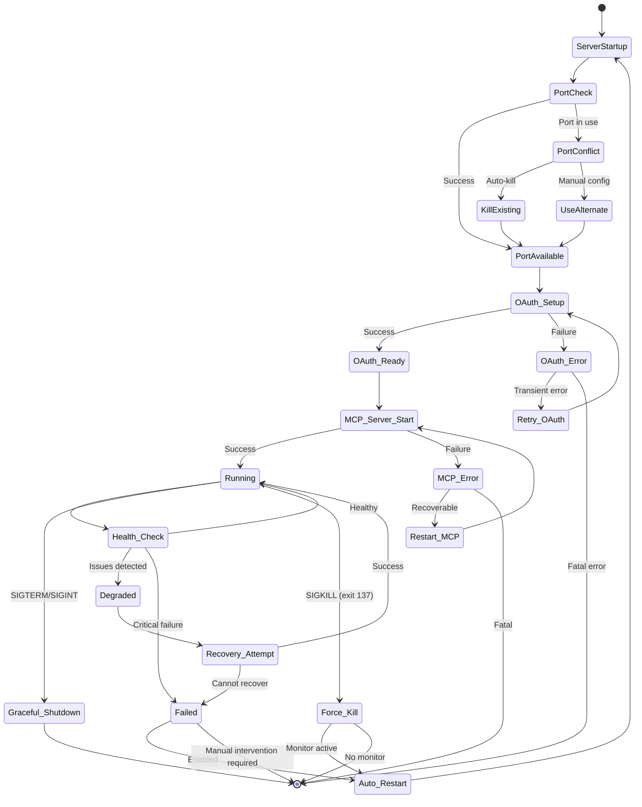
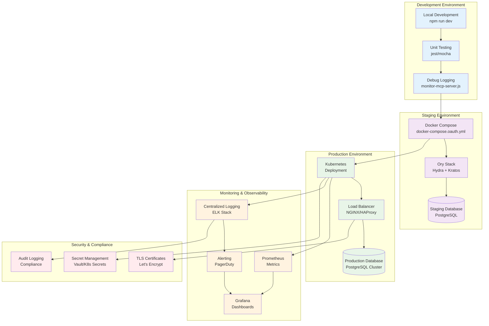
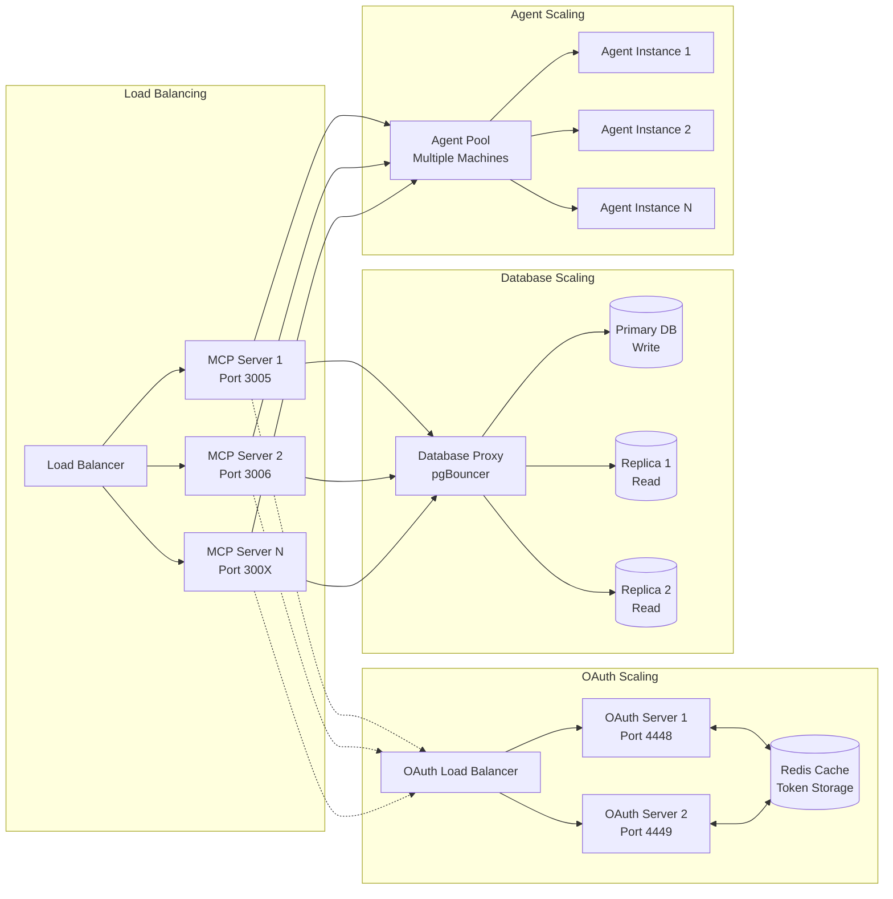

# Remote MCP Server - Workflow Diagrams

This document contains detailed workflow diagrams for understanding all processes in the Remote MCP Server system.

---

## 🔄 Complete OAuth 2.1 Authentication Flow

---

## 🏗 System Architecture Flow

---

## 🔐 Detailed OAuth Security Flow

---

## 🌐 Multi-Component System Flow

---

## 📊 Component Interaction Matrix

---

## 🔧 Error Handling and Recovery Flow

---

## 🚀 Deployment Strategy Diagram

---

## 📈 Performance and Scaling

This comprehensive collection of workflow diagrams provides visual understanding of all processes in the Remote MCP Server system, from basic OAuth flows to complex deployment strategies and scaling patterns.